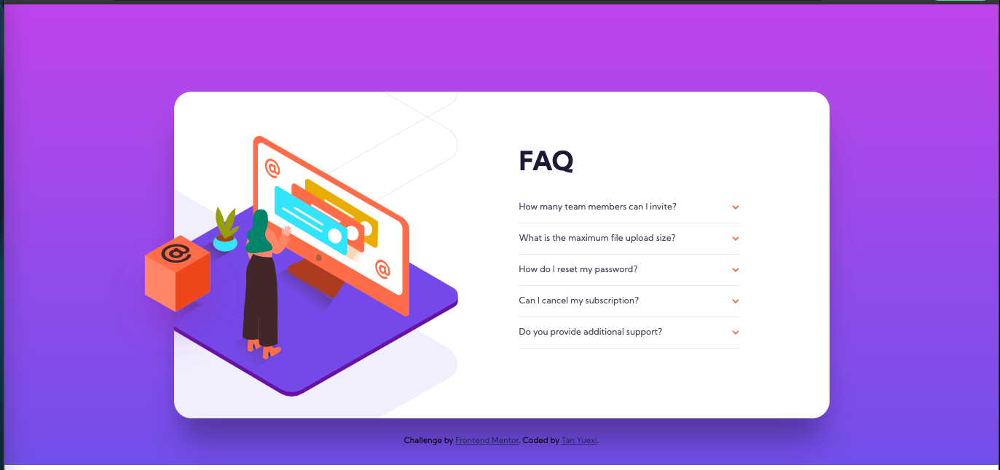

# Frontend Mentor - FAQ accordion card solution

This is a solution to the [FAQ accordion card challenge on Frontend Mentor](https://www.frontendmentor.io/challenges/faq-accordion-card-XlyjD0Oam). Frontend Mentor challenges help you improve your coding skills by building realistic projects.

## Table of contents

- [Overview](#overview)
  - [The challenge](#the-challenge)
  - [Screenshot](#screenshot)
  - [Links](#links)
- [My process](#my-process)
  - [Built with](#built-with)
  - [What I learned](#what-i-learned)
  - [Continued development](#continued-development)


## Overview

### The challenge

Users should be able to:

- View the optimal layout for the component depending on their device's screen size
- See hover states for all interactive elements on the page
- Hide/Show the answer to a question when the question is clicked

### Screenshot




### Links

- Solution URL: <https://github.com/tanyuexi/frontendmentor-faq-accordion-card/>
- Live Site URL: <https://tanyuexi.github.io/frontendmentor-faq-accordion-card/>

## My process

### Built with

- Semantic HTML5 markup
- CSS custom properties
- Flexbox
- Mobile-first workflow
- Javascript and JQuery
- Sass


### What I learned

#### Linear gradient background color

```css
// CSS
body {
  background: linear-gradient(color.$soft-violet-bg, color.$soft-blue-bg) no-repeat;
}
```

#### Add shadow to box

Syntax: `box-shadow: none|h-offset v-offset blur spread color |inset|initial|inherit;`

Example: `box-shadow: 0 40px 40px -10px rgba(0, 0, 0, 0.3);`

#### Toggle showing/hiding info

```css
// CSS
.answer-collapsed {
  display: none;
}
```

```js
// javascript
$(this).find(".answer").toggleClass("answer-collapsed");
```

#### Matching position and size of two elements that are not in the same parent

```js
// javascript
var cardSpaceholder = $(".card .spaceholder");

function resizeMask() {
  var offset = cardSpaceholder.offset();
  var height = cardSpaceholder.height();
  var width = cardSpaceholder.width();

  $(".cover-img-desktop .mask").css({
    "position": "absolute",
    "top": offset.top,
    "left": offset.left,
    "height": height,
    "width": width
  });
}

$(document).ready(function() {
  resizeMask();

  $(window).resize(function() {
    resizeMask();
  });
});
```

### Continued development

Learn and use React in this project.
